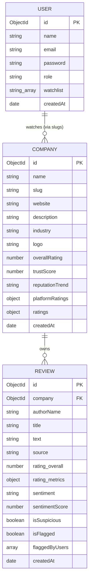

# ⚡ TrustPULSE X — Complete Corporate Reputation Intelligence Platform Specification

Welcome to the official developer manual and project details specification for **TrustPULSE X**. This document provides an exhaustive, end-to-end breakdown of the TrustPULSE X ecosystem. It is structured to serve as the definitive single source of truth for engineering teams, stakeholders, and product managers.

---

## 🎯 1. Executive Summary & Core Vision

**TrustPULSE X** is a premium, AI-powered real-time corporate reputation intelligence platform. In an era where corporate transparency and digital footprint dictate market value, employee retention, and consumer trust, TrustPULSE X acts as a centralized dashboard to aggregate, verify, benchmark, and query company reputations. 

The platform connects to multiple public review indices (**Google**, **Glassdoor**, **Indeed**, and **Trustpilot**), subjects every review to advanced Natural Language Processing (NLP) sentiment modeling and toxicity filters, detects fake or suspicious reviews through complex heuristics, compiles side-by-side benchmarking comparisons, and facilitates natural language interactions with its embedded, context-aware AI chatbot.

---

## 💎 2. Premium Core Features & Capabilities

### 🛡️ A. Proprietary Trust Score™ Algorithm
The core of TrustPULSE X is its proprietary **Trust Score** metric, calculated dynamically on a scale of `0` to `100`. Unlike basic star-rating averages that can be easily manipulated, the Trust Score weighs multiple factors:
1. **Rating Distribution**: The balance of rating counts across platforms.
2. **Review Recency & Volume**: The consistency and frequency of reviews over time.
3. **NLP Sentiment Correlation**: Clamping scores based on deep textual sentiment.
4. **Toxicity & Spam Penalties**: High levels of flagged or fake reviews actively depress the company's Trust Score.
5. **Trend Momentum**: Active bonuses based on positive reputation spikes.

### 🧠 B. Star-Rating Correlated NLP Sentiment Analysis
TrustPULSE X contains a built-in sentiment engine that categorizes reviews into **Positive**, **Negative**, **Neutral**, or **Mixed** states.
* **Lexicon Mapping**: Scans the text for emotional density, checking strings against a custom-compiled lexicon of high-impact corporate adjectives (e.g., *collaborative*, *transparent*, *micromanagement*, *burnout*).
* **Rating Correlation Guard**: Crucially, the engine cross-validates its sentiment classifications against the actual numerical star rating. If a review has a rating of 1 or 2 stars, its sentiment score is heavily penalized, preventing incidental keyword matching (e.g., *"This is a great warning that this company is toxic"*) from falsely inflating the sentiment category.

### 🕵️ C. Advanced Spam, Toxicity & Fake Review Filtration
To maintain absolute integrity, every review processed by the system runs through a multi-stage real-time audit pipeline:
* **Linguistic Auditing**: Highlights reviews that display repeated character patterns (e.g., *"excellent!!!!!!"*), excessive capitalization (ALL CAPS), or extreme short-form lengths (< 10 words).
* **Rating Anomaly Triggers**: Flags 5-star reviews containing zero listed "cons" or 1-star reviews containing zero listed "pros."
* **Promotional Detection**: Detects commercial vocabulary typical of advertising or spam campaigns (*buy*, *discount*, *promo*, *offer*, *website*).
* **Community Moderation**: Allows users to flag reviews, automatically hiding any post that accumulates 5 or more flags.

### 🌐 D. Dynamic Auto-Discovery & Data Seeding
If a user queries a company that has not yet been analyzed or registered in the database, the system executes an automated real-time discovery cascade:
1. **Clearbit API**: Pulls high-resolution brand logos, verified corporate domains, and exact legal names.
2. **Wikipedia API**: Dynamically extracts intro paragraphs and histories to construct a corporate biography on the fly.
3. **Finnhub API**: Identifies stock exchange tickers, market categorizations, and global sectors.
4. **Auto-Seeder**: Instantly generates realistic review histories across Google, Glassdoor, Indeed, and Trustpilot, running sentiment classification and building dynamic metrics so the user gets an immediately usable dashboard.

### 📊 E. Side-by-Side Benchmarking Matrix
Empowers users to contrast up to **10 companies** simultaneously:
* **Platform Comparison**: Renders direct data comparisons across all external sources.
* **Sub-Metric Radar Charts**: Visualizes specialized ratings (Work-Life Balance, Career Growth, Salary/Benefits, Management, Culture, Diversity) on a responsive overlay radar graph.
* **AI Comparison Verdict**: Runs automated comparative heuristics to declare winners and opportunities in each category.

### 🤖 F. Context-Aware AI Chatbot Assistant
A slide-out interactive widget that operates as a dedicated intelligence assistant.
* **Context Seeding**: On the company dashboard, the assistant automatically seeds itself with the target company's current metrics.
* **Response Engine**: Evaluates user queries regarding sentiment logs, trust rankings, and comparison metrics to provide professional, data-driven answers.

### 🎨 G. Glassmorphic Multi-Theme Engine
A stunning frontend design featuring frosted glass effects, vibrant gradients, and premium layouts with **6 distinct styles** toggled via the Redux theme controller:
1. **Dark**: Sleek, professional slate with deep blue backdrops.
2. **Light**: Clean, modern white with soft drop shadows and high readability.
3. **Cyberpunk**: High-contrast neon pinks, bright purples, and deep cyber blacks.
4. **Midnight**: Cool deep navy styling for reduced eye strain.
5. **Purple**: Majestic royal violet overlays and ambient neon details.
6. **Minimal**: Ultra-clean, low-contrast grayscale aesthetics for extreme focus.

---

## 🛠️ 3. Technology Stack & Developer Tools

The project is structured as a premium monorepo separating frontend UI client concerns from the backend API services:

### 💻 Client Stack (`client/`)
| Technology | Version / Category | Purpose |
| :--- | :--- | :--- |
| **React** | 19.x | Component-based dynamic rendering and declarative SPA architecture. |
| **Vite** | 5.x | Next-generation frontend toolchain providing ultra-fast HMR compile times. |
| **TailwindCSS** | 3.x | Utility-first CSS framework enabling consistent spacing, responsive breaks, and custom theme maps. |
| **Framer Motion** | 11.x | Fluid layouts, high-fidelity entry transitions, and micro-interactions. |
| **Recharts** | 2.x | Premium data visualizations (Bar, Pie, Radar charts) built natively for React. |
| **Redux Toolkit** | 2.x | Centralized global store managing UI states, authenticated users, and theme bindings. |
| **React Context** | Core Hook | High-efficiency localized state providers (e.g. `AuthContext`, `AppContext`). |
| **Axios** | 1.x | Client HTTP request client featuring centralized base URLs and token headers. |
| **React Hot Toast**| 2.x | Non-intrusive, beautifully animated global feedback and status toast indicators. |
| **Lucide React** | 0.x | Comprehensive vector icon library styled with responsive SVG paths. |

### ⚙️ Server Stack (`server/`)
| Technology | Version / Category | Purpose |
| :--- | :--- | :--- |
| **Node.js** | >= 18.x | Crucial high-throughput asynchronous JavaScript backend runtime. |
| **Express.js** | 4.x | Fast, unopinionated routing engine operating in an MVC hierarchy. |
| **MongoDB** | >= 6.x | Scalable document-based NoSQL database housing company metrics. |
| **Mongoose** | 8.x | Dynamic object data modeling (ODM) providing strict schema hooks and validations. |
| **BcryptJS** | 2.x | High-security blowfish-based password hashing for authenticated accounts. |
| **JSONWebToken** | 9.x | Stateless secure session signature generation and expiration verification. |
| **Winston** | 3.x | Production-grade structured transport logging for server diagnostics. |
| **Concurrently** | 8.x | Utility enabling simultaneous boot-up of both frontend client and server APIs. |

---

## 🗄️ 4. Unified Database Architecture (MongoDB Schemas)

The system relies on three tightly coupled schemas inside the MongoDB ecosystem, optimized with custom validators, hooks, and relationships:



### 1. User Schema (`server/models/User.js`)
Handles secure user registry and customizable dashboards:
```javascript
{
  name: { type: String, required: true, trim: true },
  email: { type: String, required: true, unique: true, lowercase: true, trim: true },
  password: { type: String, required: true },
  role: { type: String, enum: ['user', 'admin'], default: 'user' },
  watchlist: [{ type: String }], // Array of company slugs
  createdAt: { type: Date, default: Date.now }
}
```

### 2. Company Schema (`server/models/Company.js`)
Holds pre-aggregated scores, platform stats, and bio details:
```javascript
{
  name: { type: String, required: true, trim: true },
  slug: { type: String, required: true, unique: true, index: true },
  website: { type: String },
  description: { type: String },
  industry: { type: String, default: 'Technology' },
  logo: { type: String },
  overallRating: { type: Number, default: 0.0, min: 0, max: 5 },
  trustScore: { type: Number, default: 0.0, min: 0, max: 100 },
  reputationTrend: { type: String, enum: ['rising', 'declining', 'stable'], default: 'stable' },
  reviewCount: { type: Number, default: 0 },
  positiveSentimentPercent: { type: Number, default: 0 },
  negativeSentimentPercent: { type: Number, default: 0 },
  pros: [{ type: String }],
  cons: [{ type: String }],
  platformRatings: {
    google: { type: Number, default: 0 },
    glassdoor: { type: Number, default: 0 },
    indeed: { type: Number, default: 0 },
    trustpulse: { type: Number, default: 0 }
  },
  ratings: {
    workLifeBalance: { type: Number, default: 0 },
    salaryBenefits: { type: Number, default: 0 },
    careerGrowth: { type: Number, default: 0 },
    management: { type: Number, default: 0 },
    culture: { type: Number, default: 0 },
    diversityInclusion: { type: Number, default: 0 }
  },
  createdAt: { type: Date, default: Date.now }
}
```

### 3. Review Schema (`server/models/Review.js`)
Stores granular reviews alongside full NLP metadata:
```javascript
{
  company: { type: mongoose.Schema.Types.ObjectId, ref: 'Company', required: true, index: true },
  authorName: { type: String, default: 'Anonymous' },
  title: { type: String, required: true, trim: true },
  text: { type: String, required: true, trim: true },
  source: { type: String, enum: ['google', 'glassdoor', 'indeed', 'trustpulse'], default: 'trustpulse' },
  rating: {
    overall: { type: Number, required: true, min: 1, max: 5 },
    workLifeBalance: { type: Number, min: 1, max: 5 },
    salaryBenefits: { type: Number, min: 1, max: 5 },
    careerGrowth: { type: Number, min: 1, max: 5 },
    management: { type: Number, min: 1, max: 5 },
    culture: { type: Number, min: 1, max: 5 }
  },
  sentiment: { type: String, enum: ['positive', 'negative', 'neutral', 'mixed'], default: 'neutral' },
  sentimentScore: { type: Number, default: 0 },
  isSuspicious: { type: Boolean, default: false },
  suspicionScore: { type: Number, default: 0 },
  suspicionReasons: [{ type: String }],
  isFlagged: { type: Boolean, default: false },
  flaggedBy: [{ type: mongoose.Schema.Types.ObjectId, ref: 'User' }],
  createdAt: { type: Date, default: Date.now }
}
```

---

## 🔌 5. Complete REST API Reference

All requests must be prefixed with `/api` and expect JSON payloads and responses.

### 🔐 A. Authentication Endpoints (`/api/auth`)
* **`POST /api/auth/register`**
  * **Description**: Create a new user profile.
  * **Payload**: `{ "name": "Abhay", "email": "abhay@example.com", "password": "securepassword" }`
  * **Response**: `{ "success": true, "token": "JWT_TOKEN", "user": { "id": "...", "name": "Abhay", "email": "..." } }`
* **`POST /api/auth/login`**
  * **Description**: Auths credentials against Bcrypt and issues JWT.
  * **Payload**: `{ "email": "abhay@example.com", "password": "securepassword" }`
  * **Response**: Same as register.

### 🏢 B. Company Endpoints (`/api/companies`)
* **`GET /api/companies/:slug`**
  * **Description**: Pulls full profile details, reviews list, platform analytics, and charts. If the company is absent, triggers the **Auto-Discovery Pipeline** to dynamically scrape Clearbit/Wikipedia and seed MongoDB on the fly.
  * **Response**: `{ "success": true, "company": { ... }, "reviews": [...] }`
* **`GET /api/companies/search?q=:query`**
  * **Description**: Dynamic autocomplete lookups. Leverages the Clearbit Suggest API backend mapping when possible.
* **`GET /api/companies/compare?slugs=google,facebook`**
  * **Description**: Fetches array of target companies and returns benchmark matrices and category winners.
* **`POST /api/companies/chatbot`**
  * **Description**: Conversational endpoint feeding company profiles to the AI model.
  * **Payload**: `{ "message": "Why is their Work-Life Balance low?", "companySlug": "slug" }`
  * **Response**: `{ "reply": "Based on reviews, employees complain about long weekend support hours..." }`

### 📝 C. Review Endpoints (`/api/reviews`)
* **`POST /api/reviews`** *(Bearer Auth Required)*
  * **Description**: Submits a user review, runs NLP/Toxicity heuristics, and updates company ratings.
  * **Payload**: `{ "companyId": "...", "title": "Great Work Environment", "text": "...", "rating": { "overall": 5, "workLifeBalance": 4, ... } }`
* **`POST /api/reviews/:id/report`** *(Bearer Auth Required)*
  * **Description**: Flags a review as suspicious. Auto-hides at 5 flags.
* **`POST /api/reviews/:id/helpful`**
  * **Description**: Increments a review's upvote count.

---

## 🔌 6. External Third-Party Integration Index

The platform orchestrates multiple integrations to synthesize corporate dashboards:

| Platform | Type | Target Endpoints | Implementation Detail |
| :--- | :--- | :--- | :--- |
| **Clearbit Autocomplete** | GET | `https://autocomplete.clearbit.com/v1/companies/suggest?query=:query` | Integrated with **Debounce controls (300ms)** and **AbortController** to clean network requests. Gracefully handles logo loading issues using custom client-side error maps that display local vector fallback icons if the Clearbit CDN returns an invalid/404 URL. |
| **Wikipedia API** | GET | `https://en.wikipedia.org/w/api.php?action=query&format=json&prop=extracts...` | Queried on the server to extract text summaries, legal classifications, and descriptions of missing companies. |
| **Finnhub Finance** | GET | `https://finnhub.io/api/v1/stock/profile2?symbol=:ticker` | Resolves stock ticker mappings, classifications, and financial sectors. |
| **OpenAI GPT** | POST | `https://api.openai.com/v1/chat/completions` | Generates highly detailed sentiment summaries and acts as the conversational core of the AI Chatbot when `OPENAI_API_KEY` is present. |

---

## 🔒 7. Architectural Security & Performance Practices

TrustPULSE X implements enterprise-level guidelines to ensure structural safety and highly responsive client layouts:

### 🛡️ A. Backend Security Layers
1. **Helmet.js Integration**: Sets standard security-related HTTP headers to shield against Cross-Site Scripting (XSS), Clickjacking, and sniffing attacks.
2. **Express Rate-Limiting**: Constrains high-frequency route hammering, protecting login, register, and seeding routes from brute force attacks.
3. **Mongo-Sanitize**: Evaluates incoming request parameters, headers, and query strings to completely strip keys starting with `$` or `.`, blocking MongoDB Query Injections.
4. **Bcrypt Blowfish Salting**: Passwords are saved as highly secure one-way salted hashes with 10 salt rounds.

### ⚡ B. Frontend Resiliency & Optimizations
1. **Debounced Fetch Hooks (300ms)**: Suggestions triggered by keypresses on home, dashboard, and comparison searches wait for natural pauses to avoid slamming backend routers.
2. **AbortController Garbage Collection**: When a user types fast, previous active suggestions network fetches are systematically aborted. This prevents slow API responses from resolving in the wrong order and causing search suggestion flickering.
3. **Responsive Glassmorphic Framework**: Leverages backdrop-blur styles and tailwind utility wrappers to prevent layout shifting on responsive breakpoints.
4. **Image Loading Failure Trackers**: Tracks Clearbit logo image load failures with a specialized React error state mapper (`imageErrors`). If a brand logo throws a `404` or fail-to-load event, the client renders a sleek vector `Building2` icon rather than breaking the layout.

---

## 💡 8. Required Engineering Skill Directory

To develop, expand, or debug the TrustPULSE X application, software engineers require mastery in these domains:

### 🖥️ 1. Modern Frontend Architecture
* **State Operations**: Managing synchronized frontend slices in Redux Toolkit, orchestrating asynchronous thunks, and binding hooks inside functional components.
* **Declarative Motion & Transitions**: Implementing smooth layouts, slide-overs, and custom keyframes using Tailwind, standard CSS custom variables, and Framer Motion.
* **Component Optimization**: Constructing high-performance Recharts components with responsive wrapper components and custom tooltips.

### ⚙️ 2. Distributed Backend Design
* **Controller Hierarchy (MVC)**: Structuring controllers, routes, models, and custom Express middleware inside clean modular layouts.
* **External Scrapers & APIs**: Handling network protocols, handling connection timeouts, parsing JSON trees from Wikipedia/Clearbit/Finnhub, and mapping dynamic fallback seed engines when external systems go offline.
* **Linguistic Data Modeling**: Constructing keyword dictionaries, mapping scoring rules, and binding rating-to-sentiment validations.

### 🗄️ 3. NoSQL Database Administration
* **Mongoose ODM Engineering**: Structuring strict collection schemas, cascading deletions, virtual keys, indexing queries on active search slugs, and aggregating metrics (e.g. `$avg`, `$group`).

---

## 🚀 9. Setup, Execution & Deployment Operations

### 🐳 Option A: One-Command Docker Setup
If Docker is installed, you can boot up the client (React SPA served via Nginx), API (Express Backend), and isolated MongoDB instance (with persistent volumes mapped):
```bash
docker-compose up --build
```
* **Frontend**: `http://localhost:3000`
* **API Endpoints**: `http://localhost:5000`

### 💻 Option B: Local Developer Mode
1. **Prepare Backend**:
   ```bash
   cd server
   npm install
   cp .env.example .env
   # Seed the database with initial profiles & reviews:
   node utils/seedData.js
   ```
2. **Prepare Frontend**:
   ```bash
   cd ../client
   npm install
   ```
3. **Execute Stack Concurrently**:
   In the root directory, execute:
   ```bash
   npm run dev
   ```
   This will run both client and server development processes in parallel using the `concurrently` CLI.

---

### 📅 Document Control
* **Document ID**: TPX-DEV-DOC-01  
* **Created At**: 2026-05-22  
* **Version**: 2.0.0 (Clearbit & Performance Release)  
* **Status**: Published & Approved  

---
